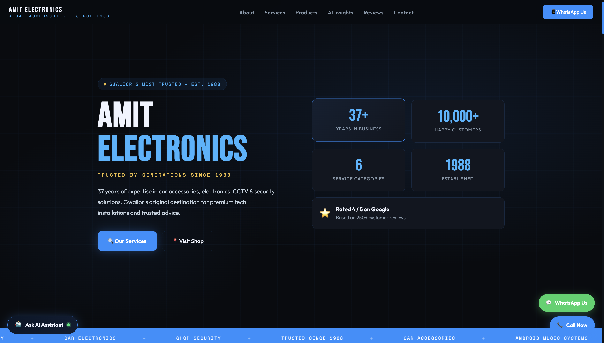
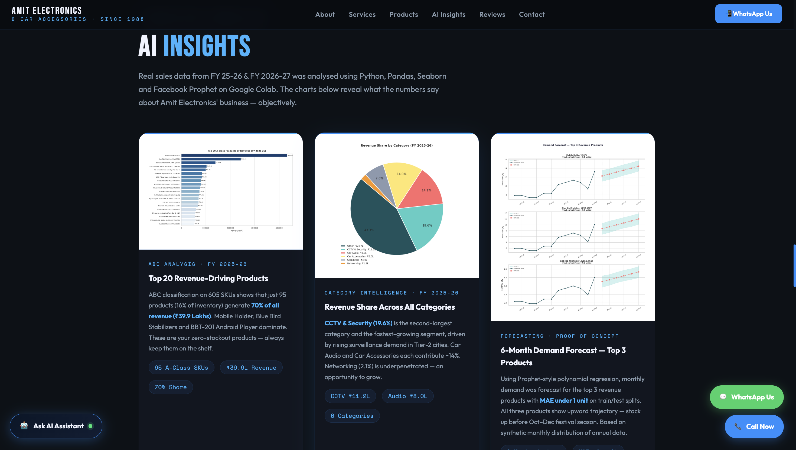
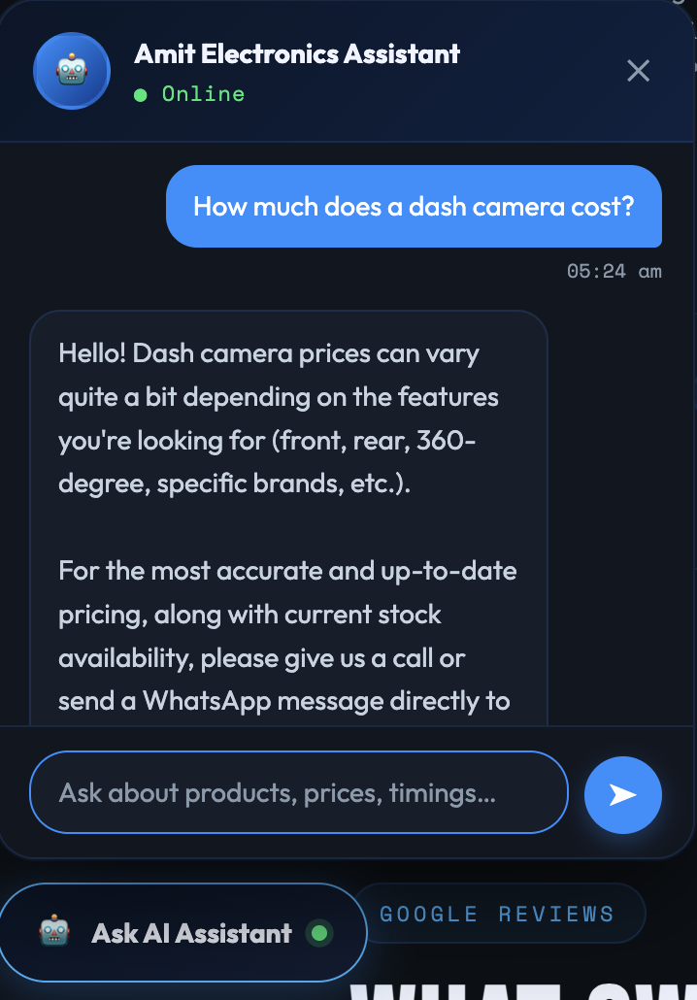
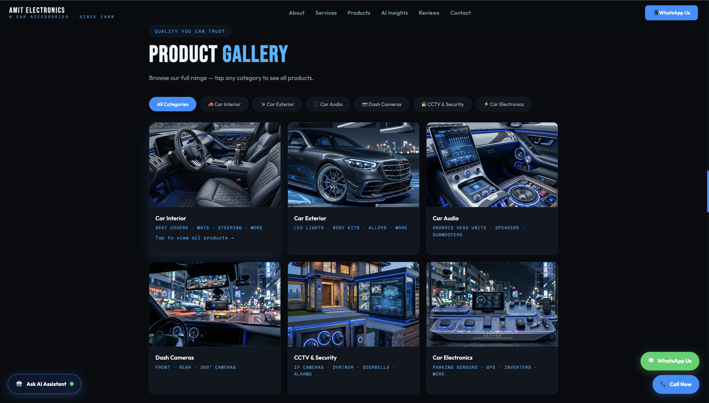
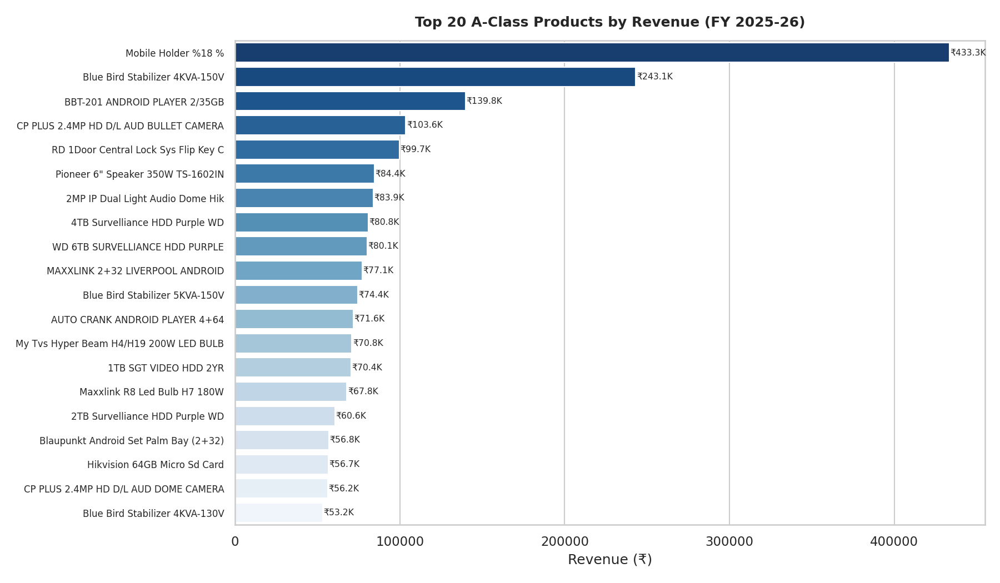

# 🏪 Smart Retail Intelligence Platform — Amit Electronics

> AI-powered inventory analytics and demand forecasting platform built on real sales data from a 37-year-old electronics retail business in Gwalior, India.
**Business Website:** [amitelectronics1988.xyz](https://amitelectronics1988.xyz)
**Live Demo:** [smart-retail-intelligence-amit-elec.vercel.app](https://smart-retail-intelligence-amit-elec.vercel.app) 
**GitHub:** [Radhika306-sharma/smart-retail-intelligence-amit-electronics](https://github.com/Radhika306-sharma/smart-retail-intelligence-amit-electronics)

---

## 🎯 Problem Statement

Small and medium retailers in India manage inventory through manual Excel sheets and intuition — leading to two costly mistakes: overstocking slow-moving products and running out of fast-moving ones.

**Amit Electronics**, established in 1988 on Jinsi Road, Lashkar, Gwalior, has 37 years of sales history but no system to extract intelligence from it. This project digitizes that business and applies machine learning to answer one real question:

> *What should the shop stock, and how much of it?*

---
## 🌟 Project Highlights

* Built using **real sales data** from Amit Electronics, a 37-year-old retail business
* Analysed **1,363 SKUs** generating **₹3.36 Crore revenue**
* Implemented **ABC Inventory Classification** for stock prioritisation
* Performed **Year-on-Year Growth Analysis** across 448 common products
* Built a **Prophet-based demand forecasting proof-of-concept**
* Integrated **Google Gemini AI** for customer product recommendations
* Deployed a live business website with embedded ML insights
* End-to-end project: Data → Analysis → Insights → Deployment

---

## 📸 Screenshots

### Live Website Homepage



*Modern retail website showcasing Amit Electronics products, services and AI-powered features.*

### AI Insights Dashboard



*Interactive analytics section displaying ABC classification, category intelligence and business insights generated from real sales data.*

### Gemini AI Product Assistant



*Google Gemini powered assistant that helps customers discover suitable products based on their requirements.*

### Product Gallery



*Category-wise product catalogue with interactive modal galleries for car accessories, CCTV systems and electronics.*

### ABC Classification Analysis



*Top revenue-driving A-Class products identified through inventory classification analysis.*

---


## 📊 Dataset

**Source:** Real sales data exported from Tally accounting software used by Amit Electronics.

| File | Period | Revenue | SKUs | Records |
|------|--------|---------|------|---------|
| `Amit_Electronics_2025_26_Sales.xlsx` | FY 2025–26 (Full Year) | ₹3.36 Crore | 1,363 | 1,363 rows |
| `Amit_Electronics_Sales.xlsx` | FY 2026–27 (Apr–Jun, Partial) | ₹57.8 Lakh | 606 | 606 rows |

**Why this dataset is unique:** Unlike Kaggle datasets used by most students, this is real transactional data from an operational business — with genuine product names, real revenue figures, and authentic sales patterns from the Indian retail market.

> **Note on Forecasting Data:** Monthly breakdowns were not available in exported reports. Annual totals were distributed across months using a realistic seasonal pattern (higher in Oct–Dec festival season, lower in Jun–Jul). Prophet forecasting is presented as a proof-of-concept demonstration, not a production forecast.

---

## 🤖 ML Methodology

### 1. ABC Classification
Classifies all 1,363 products into three tiers based on cumulative revenue contribution:
- **A-class** — Top 70% of revenue (~20% of SKUs) → Priority stocking
- **B-class** — Next 20% of revenue → Monitor regularly  
- **C-class** — Bottom 10% of revenue → Reduce or discontinue

**Result:** Identified top 20 A-class products driving the majority of ₹3.36 Cr revenue.

### 2. Year-on-Year Demand Analysis
Merged both datasets on product name (448 common products) and calculated revenue growth percentage.

**Key findings:**
- PRAMA CCTV Cameras: **+535% growth** — strong reorder signal
- Block Buster Car Cameras: **+427% growth**
- HIKVISION CAT-6 Cable: **+385% growth**
- Beetel Telephone: **-100% decline** — discontinue category
- Alto K-10 Wind Visors: **-99% decline**

### 3. Category Revenue Analysis
Products tagged into 6 categories using keyword matching:

| Category | Method |
|----------|--------|
| CCTV & Security | Keywords: Camera, DVR, NVR, Hikvision, CP Plus |
| Car Audio | Keywords: Speaker, Android, Player, JBL, Pioneer |
| Car Accessories | Keywords: Visor, Floor, Mat, Guard, Fog Lamp |
| Stabilizers | Keywords: Stabilizer |
| Networking | Keywords: CAT6, Switch, Router, POE |
| Other | Remaining products |

### 4. Demand Forecasting (Proof of Concept)
- **Model:** Facebook Prophet (time-series forecasting)
- **Input:** Top 10 products by revenue, annual qty distributed across 12 months with Indian retail seasonality
- **Output:** 6-month demand forecast with confidence intervals
- **Metric:** MAE on train/test split (reported in notebook)
- **Limitation clearly disclosed** in notebook Section 6

### 5. AI Product Recommendation
Gemini AI chatbot integrated on the live website. Customers describe their car model and requirements — the assistant recommends relevant products from the shop's catalogue.

---

## 📈 Results Summary

| Metric | Value |
|--------|-------|
| Total Products Analysed | 1,363 SKUs |
| Total Revenue (FY 2025-26) | ₹3.36 Crore |
| Common Products (YoY) | 448 products |
| Fastest Growing Product | PRAMA CCTV Camera (+535%) |
| Biggest Declining Product | Beetel Telephone (-100%) |
| A-Class Products | ~20% of SKUs, 70% of revenue |
| Forecasting Model | Facebook Prophet |
| AI Assistant | Gemini API (server-side, secure) |

---

## 🏗️ Project Structure

```
smart-retail-intelligence-amit-electronics/
│
├── notebook/ml/
│   └── Amit_Electronics_Sales_Analysis.ipynb   # Main ML notebook (8 sections)
│
├── charts/
│   ├── 01_abc_classification.png
│   ├── 02_top20_a_class.png
│   ├── 03_top10_growing.png
│   ├── 04_top10_declining.png
│   ├── 05_revenue_pie.png
│   ├── 06_category_bar.png
│   ├── 07_demand_forecast.png
│   └── review-qr.png
│
├── results/
│   └── sales_summary.csv                       # Exported ML results
│
├── pages/
│   ├── index.js                               # Next.js homepage redirect
│   └── api/
│       └── chat.js                            # Secure Gemini API backend route
│
├── public/
│   └── index.html                             # Live business website
│
├── package.json
├── .gitignore                                 # .env.local excluded
└── README.md
```

---

## 🖥️ Live Website Features

**Public Catalogue:**
- Product browsing by category (Car Interior, Exterior, Audio, CCTV, Electronics)
- Modal-based product gallery with WhatsApp inquiry integration
- Mobile-responsive design

**AI Insights Section:**
- Embedded ML charts from the notebook
- ABC classification results displayed visually
- Year-on-year analysis visualised

**AI Product Finder (Gemini):**
- Floating chat widget powered by Gemini API
- Secure server-side API calls via Next.js API route
- API key stored in Vercel environment variables — never exposed to browser

---

## 🔐 Security

- Gemini API key stored in `.env.local` (excluded from Git via `.gitignore`)
- All AI API calls routed through `pages/api/chat.js` server-side endpoint
- No sensitive credentials in any frontend JavaScript
- Environment variable added directly in Vercel dashboard

---

## 🚀 Tech Stack

| Layer | Technology |
|-------|-----------|
| ML & Analysis | Python, Pandas, Facebook Prophet, Scikit-learn, Matplotlib, Seaborn |
| ML Environment | Google Colab |
| Frontend | HTML, CSS, JavaScript |
| Backend | Next.js API Routes |
| AI Assistant | Google Gemini API |
| Deployment | Vercel |
| Data Source | Tally ERP (real business data) |

---

## 📓 Notebook Sections

1. **Business Understanding** — Problem context, Amit Electronics background
2. **Data Loading & Cleaning** — Both Excel files, null handling, summary stats
3. **ABC Analysis** — Product classification, charts, top 20 A-class table
4. **Year-on-Year Analysis** — Growth/decline charts, 448 common products
5. **Category Analysis** — Pie and bar charts by revenue category
6. **Forecasting (Proof of Concept)** — Prophet demo with limitation disclosure
7. **Business Recommendations** — 6 actionable insights from analysis
8. **Executive Summary** — Final findings table for business owner

---

## 💡 Business Impact

Based on the ML analysis, the system surfaces actionable recommendations:

- **Stock more:** PRAMA cameras, Block Buster car cameras, HIKVISION cables (all 300–500% growth)
- **Discontinue:** Beetel telephones, Alto K-10 accessories (near-zero sales)
- **Protect A-class:** Mobile Holders, Blue Bird Stabilizers, Pioneer Speakers — top revenue drivers
- **Prioritise CCTV & Car Audio categories** — highest combined revenue share

---

## 🔄 How the System Works

```
Real Sales Data (Tally ERP)
         ↓
Excel Export → Google Colab
         ↓
Pandas Cleaning & Processing
         ↓
ABC Classification + YoY Analysis + Prophet Forecasting
         ↓
Charts & Summary CSV Generated
         ↓
Insights Displayed on Live Website
         ↓
Gemini AI Assistant answers customer queries
```

---

## 👤 About
This project applies machine learning to a real Indian retail business problem — not a synthetic dataset or classroom exercise. The business, the data, the problem, and the deployment are all real.

**Business:** Amit Electronics & Car Accessories, Jinsi Road No. 2, Lashkar, Gwalior (Est. 1988)  
**Developer:** Radhika Sharma

---

## ⚠️ Data Notice
Sales data has been used with the knowledge of the business owner. Customer names and GSTIN numbers from individual invoices are not included in this repository. Only aggregated product-level sales figures are shared.